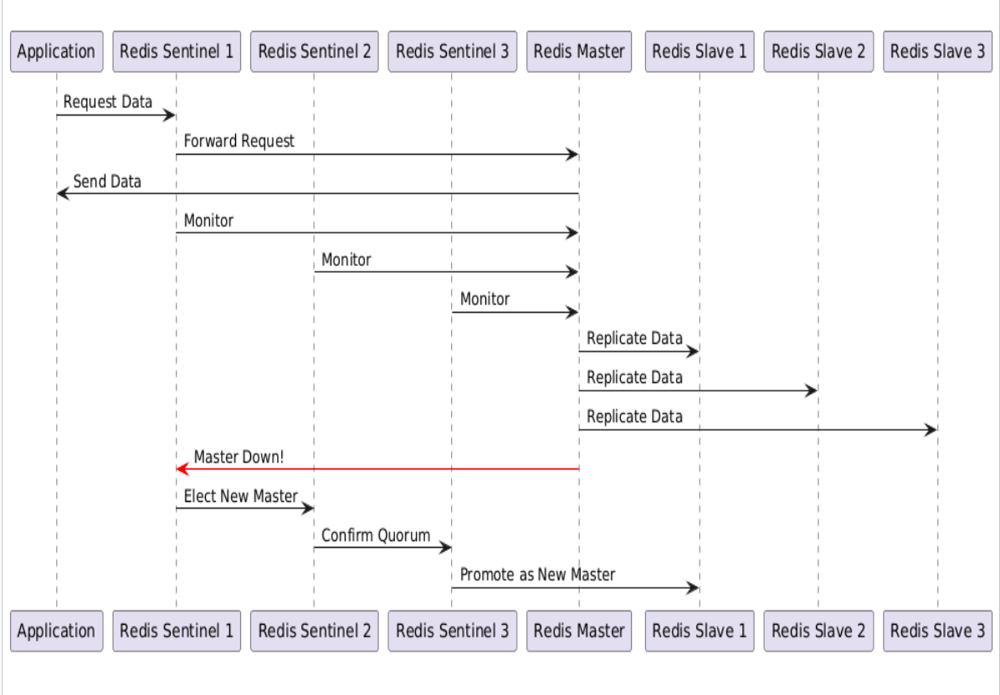

# Redis with Sentinel High Availability Setup using Podman

## Overview

### Goal
To set up a highly available Redis architecture using Redis Sentinel and Podman. This setup ensures automatic failover in case the Redis master fails, promoting one of the slaves to master.

### Architecture
- **Redis Master** (Port: 6379)
- **Three Redis Slaves** (Ports: 6380, 6381, 6382)
- **Three Redis Sentinel Instances** (Ports: 26379, 26380, 26381)
- **Podman Custom Network**: `redis-net`




## Prerequisites
- Podman installed and configured

## Table of Contents
- [1: Create a Podman Network](#1-create-a-podman-network)
- [2: Run Redis Master](#2-run-redis-master)
- [3: Run Redis Slaves](#3-run-redis-slaves)
- [4: Run Redis Sentinel Instances](#4-run-redis-sentinel-instances)
- [5: Connect to Redis Sentinel](#5-connect-to-redis-sentinel)
- [6: Test Automatic Failover](#6-test-automatic-failover)

---

## 1: Create a Podman Network

```sh
podman network create redis-net
```

Verify:

```sh
podman network ls
```

Sample Output:

```
NETWORK ID    NAME        VERSION     PLUGINS
0ce2d3d02833  redis-net   0.4.0       bridge,portmap,firewall,tuning,dnsname
```

---

## 2: Run Redis Master

Run the **Redis Master** on port 6379, connecting it to `redis-net`:

```sh
podman run --name redis_master --network=redis-net -p 6379:6379 -d docker.io/library/redis
```

Verify:

```sh
podman ps
```

---

## 3: Run Redis Slaves

Run **three Redis Slave** instances on ports 6380, 6381, and 6382, linking them to the master:

```sh
podman run --name redis_slave_1 --network=redis-net -p 6380:6379 -d docker.io/library/redis redis-server --replicaof redis_master 6379
podman run --name redis_slave_2 --network=redis-net -p 6381:6379 -d docker.io/library/redis redis-server --replicaof redis_master 6379
podman run --name redis_slave_3 --network=redis-net -p 6382:6379 -d docker.io/library/redis redis-server --replicaof redis_master 6379
```

Verify:

```sh
podman ps
```

---

## 4: Run Redis Sentinel Instances

Run **three Redis Sentinel** instances on ports 26379, 26380, and 26381:

```sh
podman run --name redis_sentinel_1 --network=redis-net -d -e REDIS_MASTER_HOST=redis_master -e REDIS_SENTINEL_PORT_NUMBER=26379 -e REDIS_SENTINEL_QUORUM=2 -p 26379:26379 docker.io/bitnami/redis-sentinel:latest
podman run --name redis_sentinel_2 --network=redis-net -d -e REDIS_MASTER_HOST=redis_master -e REDIS_SENTINEL_PORT_NUMBER=26380 -e REDIS_SENTINEL_QUORUM=2 -p 26380:26380 docker.io/bitnami/redis-sentinel:latest
podman run --name redis_sentinel_3 --network=redis-net -d -e REDIS_MASTER_HOST=redis_master -e REDIS_SENTINEL_PORT_NUMBER=26381 -e REDIS_SENTINEL_QUORUM=2 -p 26381:26381 docker.io/bitnami/redis-sentinel:latest
```

Verify:

```sh
podman ps
```

---

## 5: Connect to Redis Sentinel

To check **which node is the current Redis master**, connect to one of the Sentinels:

```sh
podman run -it --rm --network=redis-net docker.io/library/redis redis-cli -h redis_sentinel_1 -p 26379
```

Run the following command inside the Redis client:

```sh
SENTINEL get-master-addr-by-name mymaster
```

---

## 6: Test Automatic Failover

To test the failover, stop the Redis master container:

```sh
podman stop redis_master
```

Check Sentinel logs to confirm the promotion of a new master:

```sh
podman logs redis_sentinel_1
```

To reconnect, run:

```sh
podman run -it --rm --network=redis-net docker.io/library/redis redis-cli -h <NEW_MASTER> -p 6379
```

This setup ensures Redis remains highly available even in case of master failure.
